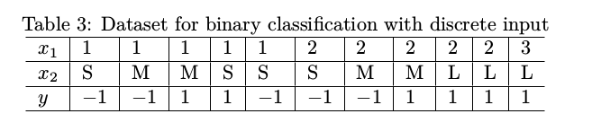

# program discription
Implement the AdaBoost algorithm, with decision stamp as base learner,
by yourself. Use the dataset in Table 3 for training, and x = (1, M ) for
test.
# training data 


# solution 
see HW10_36_AdaBoost.py

# results
We directly invoke AdaBoostClassifier in scikit-learn to complete training and testing.
Number of estimators is set as 3 and learning rate is set as 0.01.

##data
```
X_train = np.array([[1, 1, 1, 1, 1, 2, 2, 2, 2, 2, 3],[S, M, M, S, S, S, S, S, L, L, L]])
X_train = np.transpose(X_train,[1,0])
X_test = np.array([[1, M]])
y_train = np.array([-1, -1, 1, 1, -1, -1, -1, 1, 1, 1, 1])
y_test = np.array([-1])
```

fitting and training process are shown as follows:
``` 
input X:(1, M), predicted results: [-1], GT: [-1]
Accuracy: 1.0
```