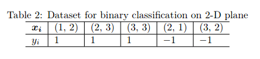

# program discription
Invoke the SVM function in scikit-learn to calculate a linear SVM forthe dataset given in Table 2.

# training data 

# solution 
see HW7_27_SVM.py

# results
We directly invoke SVM function in scikit-learn to complete training and testing.
test data is:

x=[(1,2),(2,3)] 

y=[1,1]

fitting and training process are shown as follows:
``` 
training ...
train accuray 1.0
testing ...
test accuray 1.0

```