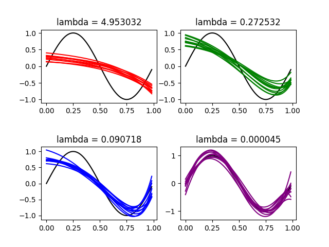

# program discription
Randomly generate 100 datasets, each of which consists of 25 points
that are samples of y = sin(2πx)+e, where x ∈ {0.041×i, i = 0, 1, . . . , 24},
and e is additive white Gaussian noise with N (0, 0.3^2). Perform ridge
regression on each dataset with 7th-order polynomial (with 8 free parameters) with different values of λ. Observe the results with respect to λ.
# setting
we set lnλ as 1.6, -1.3, -2.4, -10, separately. And we visualize 10 lines for each dataset.
# observation

With λ goes lower, bias becomes smaller while variance becomes relatively bigger.

* output \

# Implement
see HW3_16_ridge_regression.py
