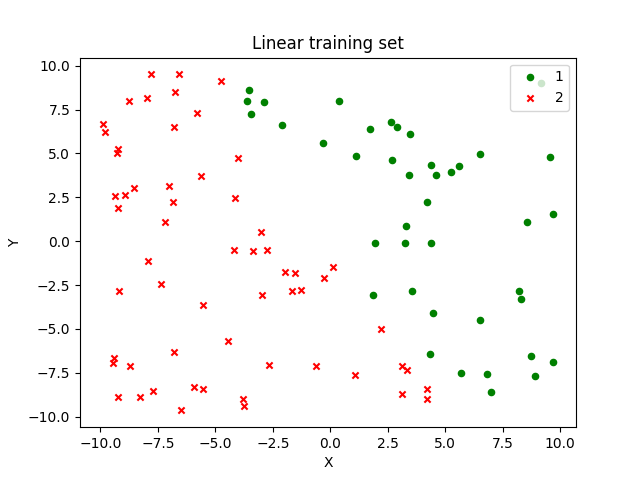
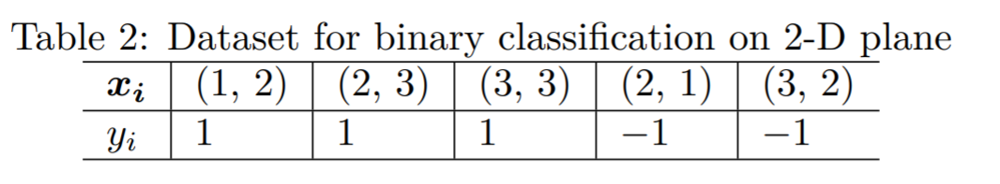

# program discription
Implement the perceptron learning algorithm by yourself. Use the
dataset in Table 2 to test your algorithm
# setting
* input dataset distribution

* test dataset 

# version
Since perception exmples shown in the sildes are versions without bias b, here we apply perceptron with bias and 
no bias estimation could be obtained if we set bias b as 0.

# results
Applying data from table2, the iterative w,b results of perceptron is:
```
[0. 0.] 0
[2.7371687  0.51764411] [-1.]
[-1.4669612   9.51619816] [-2.]
[8.3297421  3.30869506] [-3.]
[ 4.1256122  12.30724911] [-4.]
[13.92231549  6.099746  ] [-5.]
[ 9.7181856  15.09830005] [-6.]
[19.62795241  8.39388506] [-7.]
[15.42382252 17.39243911] [-8.]
[23.38840636  9.23308423] [-9.]
[19.18427646 18.23163828] [-10.]
[24.99257071 10.93567795] [-11.]
[20.78844081 19.934232  ] [-12.]
[26.59673507 12.63827168] [-13.]
[23.12960331 19.86614046] [-12.]
[28.93789757 12.57018014] [-13.]
[24.73376767 21.56873419] [-14.]
[30.54206192 14.27277386] [-15.]
[27.07493017 21.50064265] [-14.]
[31.39438289 15.08720617] [-13.]
[27.17625103 23.53268618] [-14.]
[32.98454528 16.23672585] [-15.]
[28.76641342 24.68220586] [-16.]
[34.57470768 17.38624554] [-17.]
---final results of w and b is: [34.57470768 17.38624554] [-17.]
predict results is: [1, 1, 1, 1, 1]
error is : [ True  True  True False False]
```

# Implement
see HW5_24_perceptron.py
