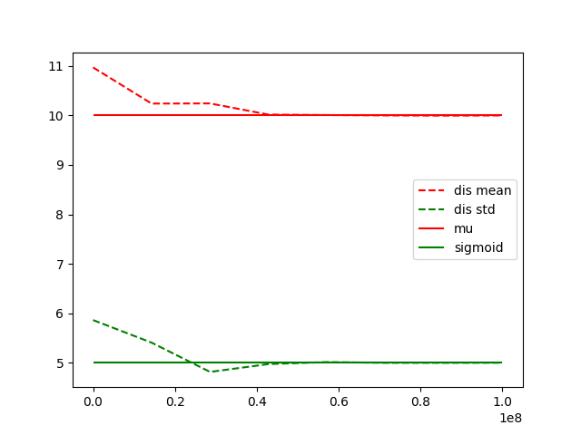
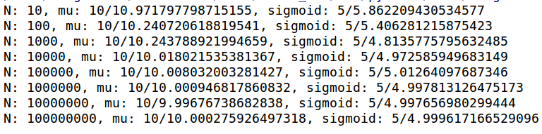

# program discription
Choose a pair of parameters (µ, σ2) to generate N random numbers that
follow the Gaussian distribution, then calculate the mean and variance of
the random numbers and compare with the ground-truth (µ, σ2). Set N
to 100, 1000, 10000, 100000, …, to observe the change of results.
# setting

Given µ = 10, σ = 5, numbers N varies from 10 to 1e8
 

#observation
With N goes from 10 to 1e8, mean and variance of N random numbers approach to given µ = 10 and σ= 5, gradually. \
Results are shown as follows.

* approching curve

* output \
Given value and distribution value are place before and after '/', seperately.

# Implement
see HW1_5_Gaussain_distribution.py